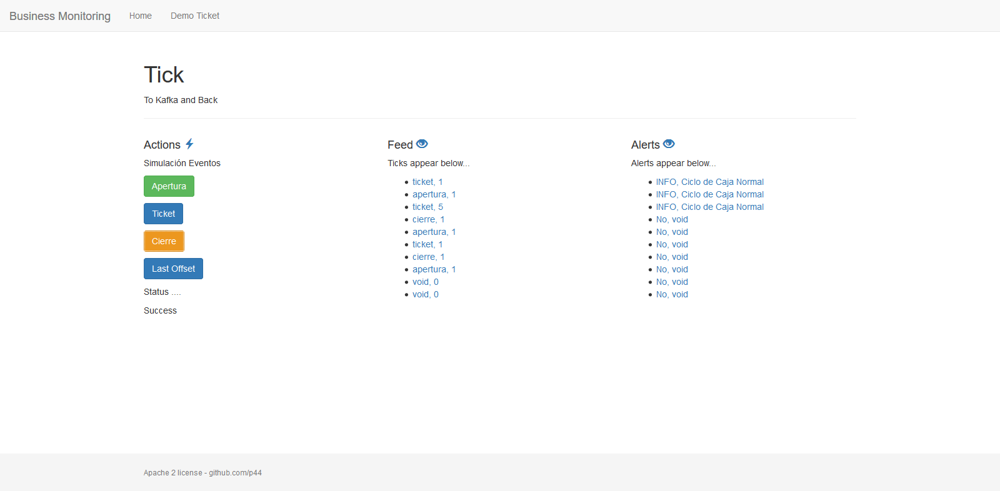
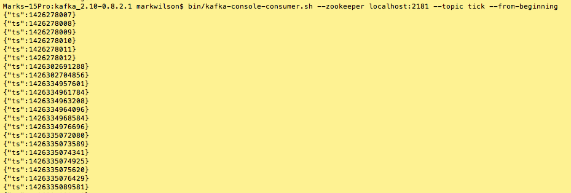

Play-Kafka
=========
Playframework -  Simple Kafka Example
**[Apache Kafka Home](http://kafka.apache.org/)**

This example uses
--------------

* Scala 2.12.3
* Playframework 2.6.12
* Kafka 2.11-1.0.0
* Bootstrap 3.3.2
* AngularJs 1.2.18

About
--------------

What the application does:

Frontal de una aplicación con la siguiente arquitectura:
- Frontal Web (esta aplicación)
- Kafka
- Flink: como stream processing y CEP
- ElasticSearch como repositorio.
- Kibana, presentación de Cuadros de mando en tiempo real.

/ -> Home con una descripción de casos de uso
/demoticket                     Pantalla para lanzar los eventos que Flink procesa y
/tick/:tipo                     REST usado para crear los diferentes tipos de tickets (Apertura, Ticket, Cierre)
/feed/tick                      REST que crear el chunk usado para actualizar Angular con la información de vuelta

Screenshot

Otros Servicios. API REST usados para probar la arquitectura de actores (Akka Actors)
/promoGet                      	Agregación de dos invocaciones(consultas simuladas) con un patron ask (?)
/promoPP                      	Invocación de una consulta(Simulada) convertida a un patron tell (!)
/promoFF                      	Agregación de dos invocaciones(consultas simuladas) con un patron Aggregator [Usa tell]
/promoFF_ES                     Agregación de dos invocaciones(consultas a API ElasticSearch) con un patron Aggregator [Usa tell]

# Demo Maps
/maps                     		Devuelve una pantalla de Google Maps con marcadores usando el Javascript API de Maps.

Kafka Settings
--------------
This application depends upon a running instance of kafka

The server settings and topic name is pulled from application.conf

You can use whatever Kafka server setup you chose.

The simplest way is to follow the **[Kafka Quick Start](http://kafka.apache.org/documentation.html#quickstart)**

* bin/zookeeper-server-start.sh config/zookeeper.properties
* bin/kafka-server-start.sh config/server.properties

Then create the topic that you set in the config file.  By default it is "tick"

* bin/kafka-topics.sh --create --zookeeper localhost:2181 --replication-factor 1 --partitions 1 --topic tick
* bin/kafka-topics.sh --create --zookeeper localhost:2181 --replication-factor 1 --partitions 1 --topic pattern-event

License
--------------
This application is provided under the Apache 2 License

